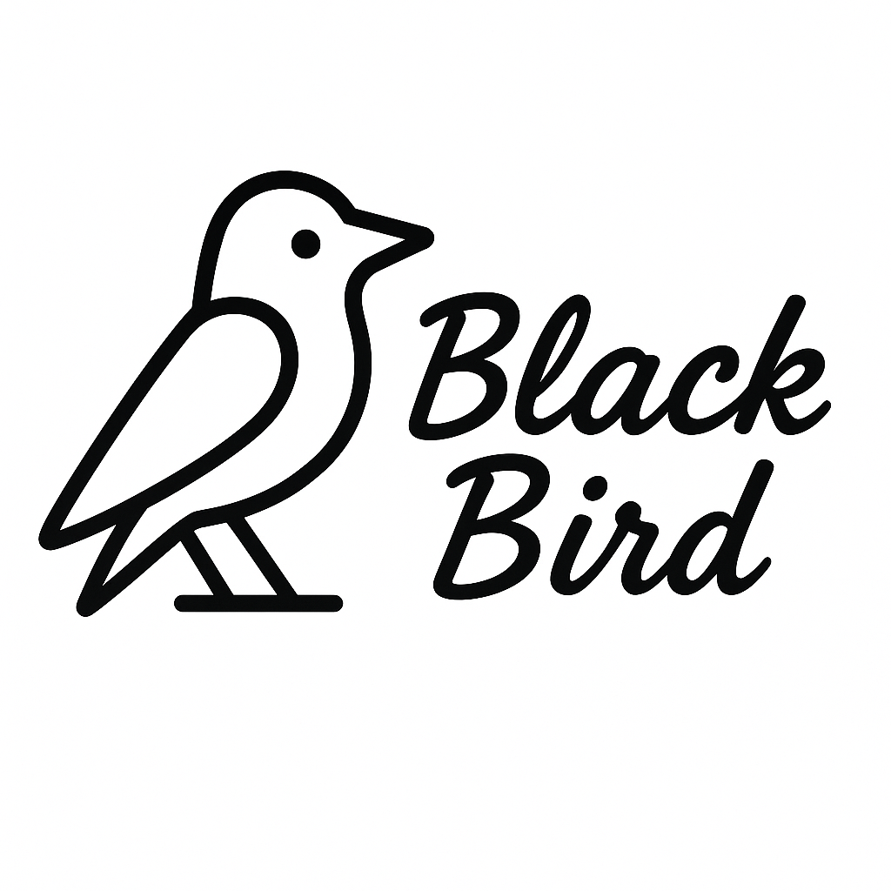

<p align="center">
  
</p>

<h1 align="center">Blackbird</h1>

<p align="center">
  
  
  
  
  
  
</p>

<p align="center">
  Blackbird 是一个简洁、高效的 iOS RSS 阅读器应用，使用 SwiftUI 和 SwiftData 构建。它允许用户添加、管理和阅读来自各种网站的 RSS/Atom/JSON Feed 订阅源。
</p>

## ✨ 功能特点

- 添加、删除和刷新 Feed 订阅源
- 按分类组织 Feed
- 标记/收藏喜爱的 Feed 和文章
- 直接在应用内阅读文章内容，支持 HTML 渲染
- 标记文章为已读/未读
- 收藏重要文章以便稍后阅读
- 支持文章标签管理
- 保存阅读位置
- 搜索文章功能
- 深色模式支持
- 使用 SwiftData 进行本地数据持久化

## 🛠️ 技术栈

- **SwiftUI**：用于构建现代化、响应式的用户界面
- **SwiftData**：用于数据持久化和管理
- **MVVM 架构模式**：清晰的代码组织和关注点分离
- **FeedKit**：用于解析 RSS/Atom/JSON Feed
- **Swift 并发（async/await）**：处理异步操作
- **WebKit**：用于在应用内显示 HTML 内容
- **XCTest**：全面的单元测试和 UI 测试

## 📱 系统要求

- iOS 17.0 或更高版本
- 支持 iPhone 15/16 系列和最新两代 iPad 设备
- Xcode 15.0 或更高版本

## 🚀 开发设置

### 前提条件

- 安装最新版本的 Xcode
- 安装 [XcodeGen](https://github.com/yonaskolb/XcodeGen)（`brew install xcodegen`）

### 构建步骤

1. 克隆仓库：
   ```bash
   git clone https://github.com/deadjoe/blackbird.git
   cd blackbird
   ```

2. 生成 Xcode 项目：
   ```bash
   xcodegen
   ```

3. 打开生成的 Xcode 项目：
   ```bash
   open Blackbird.xcodeproj
   ```

4. 构建并运行应用

### 使用命令行运行应用

你可以使用以下命令在模拟器中运行应用：

```bash
# 列出可用的模拟器
xcrun simctl list devices available

# 启动模拟器（以 iPhone 15 Pro Max 为例）
xcrun simctl boot "iPhone 15 Pro Max"

# 构建并安装应用到模拟器
xcodebuild -project Blackbird.xcodeproj -scheme Blackbird -destination "platform=iOS Simulator,name=iPhone 15 Pro Max" build

# 在模拟器中启动应用
xcrun simctl launch booted com.deadjoe.blackbird
```

## 📂 项目结构

```
Blackbird/
├── BlackbirdApp.swift    # 应用入口点
├── Models/               # 数据模型（Feed、Article、FeedCategory）
├── Views/                # SwiftUI 视图
│   ├── FeedListView      # Feed 列表视图
│   ├── ArticleListView   # 文章列表视图
│   ├── ArticleDetailView # 文章详情视图
│   ├── StarredArticlesView # 收藏文章视图
│   └── Components/       # 可复用组件
├── ViewModels/           # 视图模型
│   ├── FeedListViewModel # Feed 列表视图模型
│   ├── ArticleViewModel  # 文章视图模型
│   └── CategoryViewModel # 分类视图模型
├── Services/             # 服务层
│   └── FeedService       # Feed 服务（获取和解析 Feed）
├── Extensions/           # Swift 扩展
│   └── StringExtensions  # 字符串处理扩展
└── Utils/                # 工具类
```

## 🧪 测试

项目包含全面的单元测试，涵盖了核心功能、数据模型和视图模型。测试文件组织如下：

```
BlackbirdTests/
├── ModelTests.swift             # 数据模型测试
├── ArticleViewModelTests.swift  # 文章视图模型测试
├── CategoryViewModelTests.swift # 分类视图模型测试
├── FeedListViewModelTests.swift # Feed 列表视图模型测试
├── FeedServiceTests.swift       # Feed 服务测试
├── StringExtensionsTests.swift  # 字符串扩展测试
├── ArticleDetailViewTests.swift # 文章详情视图测试
├── ArticleListViewTests.swift   # 文章列表视图测试
├── FeedListViewTests.swift      # Feed 列表视图测试
└── StarredArticlesViewTests.swift # 收藏文章视图测试
```

### 运行测试

使用 Xcode：
```bash
xcodegen
open Blackbird.xcodeproj
# 在 Xcode 中按 Cmd+U 运行测试
```

使用命令行：
```bash
xcodebuild test -project Blackbird.xcodeproj -scheme Blackbird -destination "platform=iOS Simulator,name=iPhone 15 Pro Max"
```

## 🤝 贡献

欢迎提交 Pull Request 和 Issue。请确保新代码有适当的测试覆盖率。

## 📄 许可证

MIT
